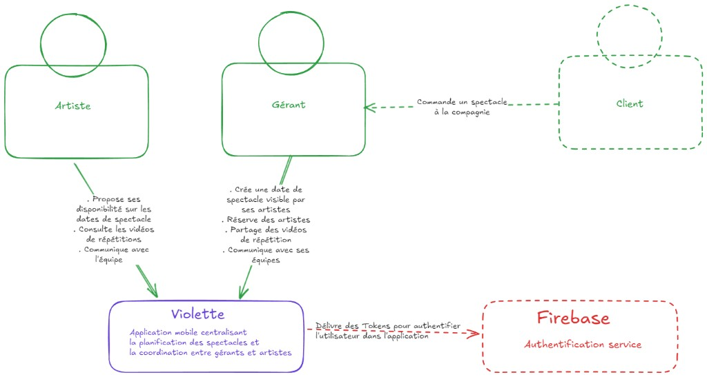
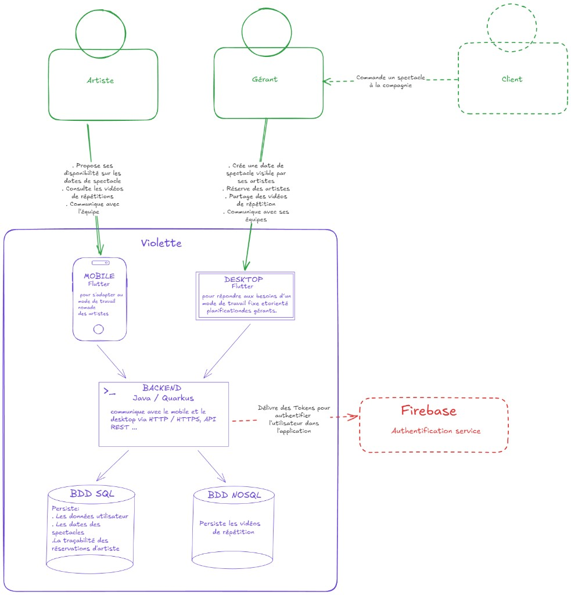
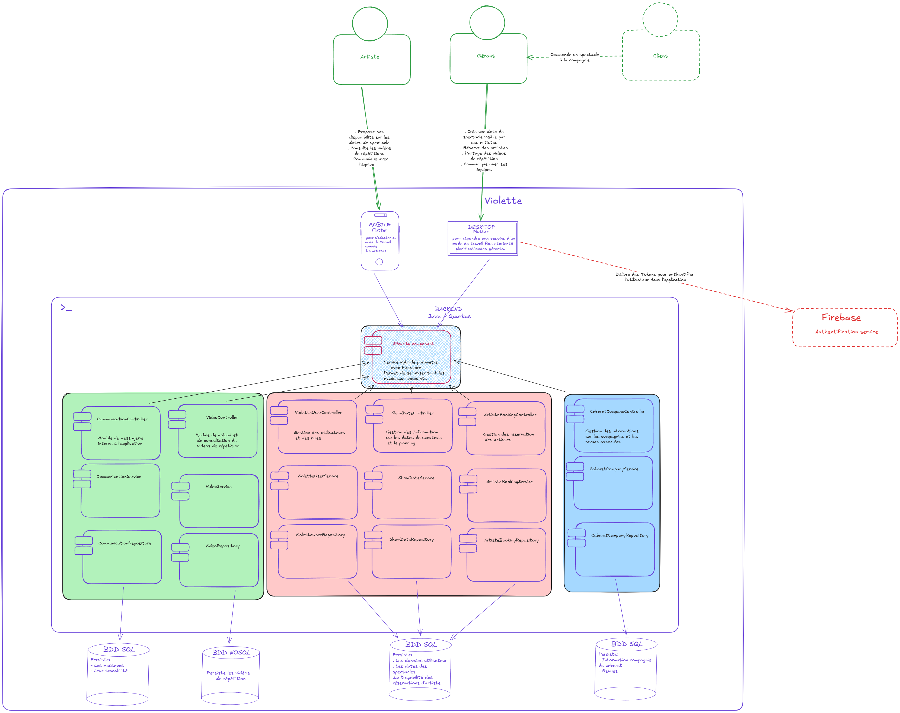
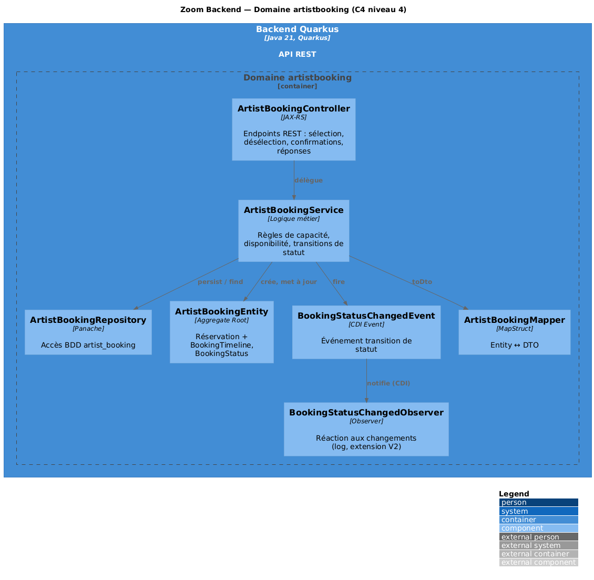
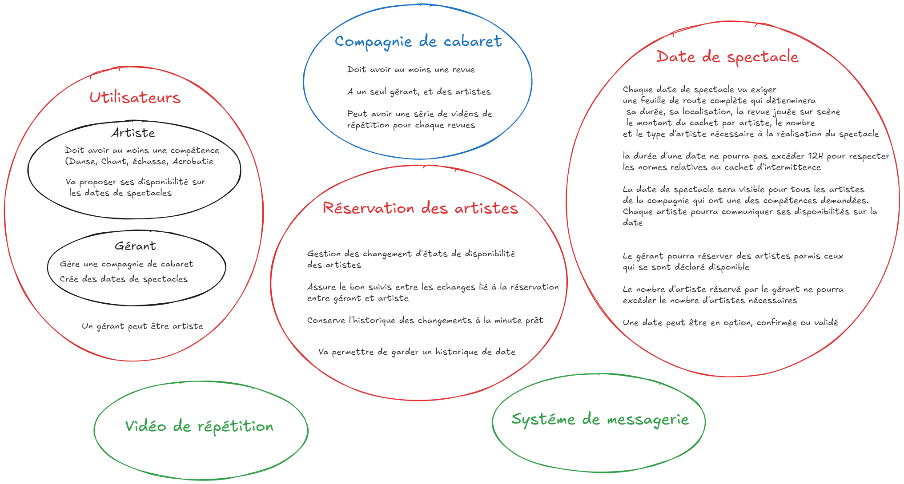
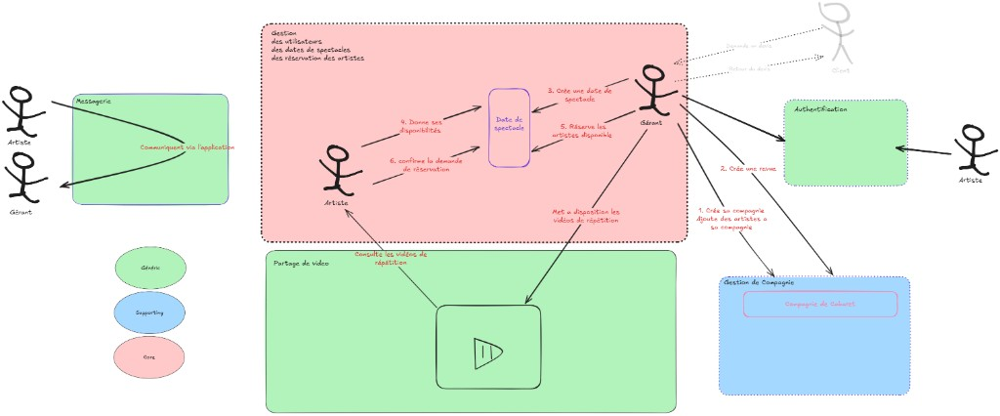

# Projet-Violette
Plateforme web de gestion des plannings et des cachets pour gérants de compagnie artistiques et intermittents du spectacle . L'outil centralisera les disponibilités, les réservations, les vidéos de répétition et la communication entre gérants et artistes

---

## → Documentation architecture & backend (module architecture logicielle)

**Toute la documentation technique du projet** (architecture, design patterns, DDD, stack, démarrage, tests, Docker, manuel utilisateur) est centralisée dans le README du backend. Un seul lien pour y accéder :

**[📄 violette-back/README.md](violette-back/README.md)**

---

## Documentation

### Pour les examinateurs

| Document | Contenu | Lien |
|----------|---------|------|
| **Manuel technique backend** | Architecture, couches, packages, sécurité, démarrage, tests, commandes Maven | [violette-back/README.md](violette-back/README.md) |
| **Architecture détaillée** | Patterns, DDD, sécurité JWT, flux de requête, décisions de modélisation | [violette-back/ARCHITECTURE.md](violette-back/ARCHITECTURE.md) |
| **Description fonctionnelle** | Contexte métier, acteurs, fonctionnalités, workflow | [docs/functional-spec.md](docs/functional-spec.md) |
| **Manuel utilisateur** | Guide gérant et artiste, statuts, bonnes pratiques | [docs/user-manual.md](docs/user-manual.md) |
| **Workflow de réservation** | Statuts, transitions, règles métier détaillées | [docs/booking-workflow.md](docs/booking-workflow.md) |
| **Documentation C4** | Explication des diagrammes C4 (contexte, container, composants, zoom niveau 4) | [docs/architecture-c4.md](docs/architecture-c4.md) |
| **Changelog** | Historique des versions | [CHANGELOG.md](CHANGELOG.md) |

### Intégration continue

Le pipeline CI (GitHub Actions) lance automatiquement `mvn clean verify` à chaque push sur les branches configurées, incluant les tests unitaires et le rapport de couverture JaCoCo (≥ 30 % de lignes couvertes).

→ [.github/workflows/backend-ci.yml](.github/workflows/backend-ci.yml)

---

## Architecture

### C4 — Contexte système

Vue d'ensemble du système Violette et de ses interactions avec les utilisateurs et services externes.



### C4 — Containers

Architecture technique : frontend Flutter, backend Quarkus, bases de données et services externes.



### C4 — Components (Backend)

Découpage modulaire du backend par domaine métier (violetteuser, showdate, artistbooking, cabaretcompany).



### C4 — Zoom composant (niveau 4) — Domaine artistbooking

Détail des composants et flux à l’intérieur du domaine **artistbooking** (Controller, Service, Repository, Entity, Event, Observer, Mapper). Source : [docs/diagrams/c4-component-artistbooking.puml](docs/diagrams/c4-component-artistbooking.puml). Pour afficher le PNG : générer à partir du .puml (voir [docs/diagrams/README.md](docs/diagrams/README.md)).



### Domain-Driven Design — Bounded Contexts

Cartographie des domaines métier avec distinction Core / Supporting / Generic.



### Domain Storytelling

Flux fonctionnels principaux : déclaration de disponibilité, réservation d'artistes, gestion de compagnie.



---

## État actuel (v0.2.0)

### Front-end (Flutter)
- Application Flutter avec architecture Stacked.
- Authentification Firebase avec gestion des rôles (gérant / artiste).
- Création et gestion des dates de spectacle (ShowDate).
- Vue Planning gérant avec calendrier et gestion des disponibilités par artiste.
- Profils utilisateurs stockés dans Firestore.
- Infrastructure de tests unitaires et intégration continue (GitHub Actions).

### Back-end (Quarkus) – v0.1.0
- Architecture modulaire par domaine (violetteuser, cabaretcompany, showdate, artistbooking).
- Stack : Quarkus 3.29, Hibernate ORM Panache, Flyway, OpenAPI/Swagger.
- Schéma SQL relationnel complet (remplace progressivement Firestore).
- Endpoint de santé : `GET /api/ping`
- Swagger UI : `http://localhost:8080/swagger-ui`
- Pas encore connecté au front (phase suivante : intégration JWT Firebase).

## Stack technique

- Front : Flutter + Stacked + Firebase Auth + Firestore
- Back : Quarkus (Java)

## Lancement rapide

Front Flutter :

```bash
cd violette_front
flutter pub get
flutter run
```

Back Quarkus :
```bash
cd violette-back
./mvnw quarkus:dev
# ou avec Maven global : mvn quarkus:dev
```

**Alternative avec Docker :** backend + MySQL en conteneurs — voir [violette-back/README.md](violette-back/README.md) section « Lancer avec Docker (docker-compose) ».

Journal des versions:

Voir le fichier [CHANGELOG.md](CHANGELOG.md)