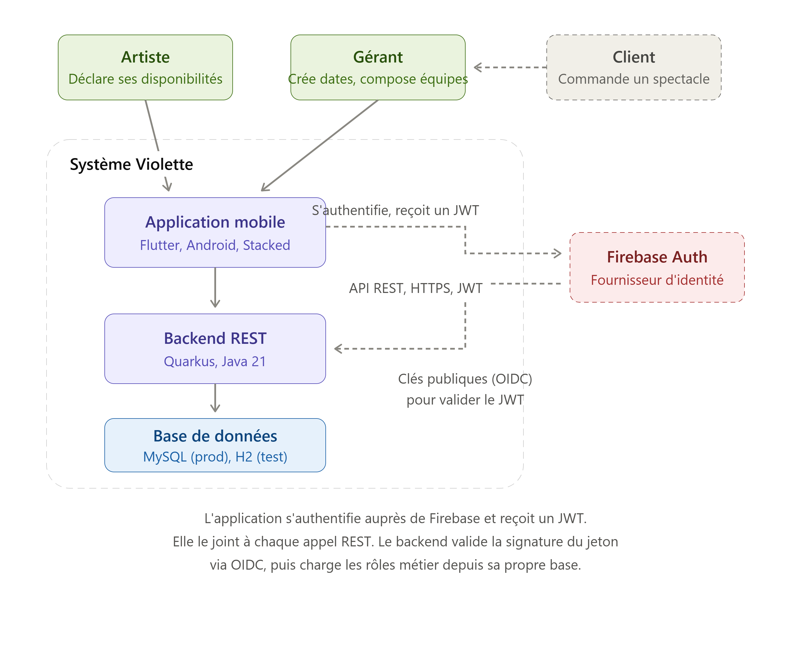

# Projet Violette

Violette est une application mobile qui aide les **compagnies de cabaret** à organiser leurs spectacles : planification des dates, collecte des disponibilités des artistes et suivi des réservations, dans un outil unique partagé entre **gérants** et **artistes**.

- **Version : v0.5.0** — sécurisation OWASP, verrou métier de disponibilité, accessibilité WCAG 2.2 AA sur les parcours clés, refonte visuelle ([journal des versions](CHANGELOG.md)).
- **Stack** : Flutter (Android) · Quarkus / Java 21 · Firebase Auth · MySQL en production, H2 en local.

| Vous êtes… | Commencez ici |
|---|---|
| **Artiste ou gérant** | [Installer l'application](INSTALLATION.md), puis le [manuel d'utilisation](docs/user-manual.md) |
| **Examinateur** | [Documentation pour les examinateurs](#documentation-pour-les-examinateurs), ci-dessous |
| **Développeur** | [Démarrage local](docs/demarrage-local.md), puis l'[architecture](docs/architecture.md) |

---

## Installer l'application (artistes et gérants)

L'installation ne demande **aucune compétence technique**. Le guide pas à pas — téléchargement, installation, première connexion, problèmes courants — est dans un document dédié :

**[INSTALLATION.md — Installer Violette sur Android](INSTALLATION.md)**

Ensuite : le [manuel d'utilisation](docs/user-manual.md) pour vous servir de l'application, et le [manuel de mise à jour](docs/manuel-mise-a-jour.md) pour passer aux nouvelles versions.

---

## Documentation pour les examinateurs

| Document | Contenu | Lien |
|----------|---------|------|
| **Cahier de recettes** | **(éliminatoire)** 49 scénarios (authentification, dates, disponibilités, réservation, sécurité, accessibilité), résultats observés, anomalies liées | [docs/cahier-de-recettes.md](docs/cahier-de-recettes.md) |
| **Sécurité (OWASP Top 10)** | **(éliminatoire)** Couverture des 10 failles OWASP : mesures, preuves, limites assumées | [docs/securite-owasp.md](docs/securite-owasp.md) |
| **Accessibilité** | **(éliminatoire)** Référentiel WCAG 2.2 AA : choix, justification, périmètre et test au lecteur d'écran | [docs/accessibilite.md](docs/accessibilite.md) |
| **Plan de correction des bogues** | Barème de gravité, cycle complet de traitement par anomalie | [docs/plan-correction-bogues.md](docs/plan-correction-bogues.md) |
| **Description fonctionnelle** | Contexte métier, acteurs, fonctionnalités, workflow | [docs/functional-spec.md](docs/functional-spec.md) |
| **Manuel d'installation** | Installation de l'application par un utilisateur final (Android) | [INSTALLATION.md](INSTALLATION.md) |
| **Manuel d'utilisation** | Guide gérant et artiste, statuts, bonnes pratiques | [docs/user-manual.md](docs/user-manual.md) |
| **Manuel de mise à jour** | Mise à jour côté utilisateur (APK) et côté exploitant (tag, migrations Flyway) | [docs/manuel-mise-a-jour.md](docs/manuel-mise-a-jour.md) |
| **Règles métier** | Statuts, disponibilités, présélection, booking ferme | [docs/regles-metier.md](docs/regles-metier.md) |
| **Workflow de réservation** | Vue workflow et variantes futures | [docs/booking-workflow.md](docs/booking-workflow.md) |
| **Architecture globale** | Séparation Flutter / Quarkus / Firebase Auth, couches REST frontend | [docs/architecture.md](docs/architecture.md) |
| **Documentation C4** | Explication des diagrammes C4 (contexte, container, composants, zoom niveau 4) | [docs/architecture-c4.md](docs/architecture-c4.md) |
| **Manuel technique backend** | Architecture, couches, packages, sécurité, démarrage, tests, commandes Maven | [violette-back/README.md](violette-back/README.md) |
| **Architecture backend détaillée** | Patterns, DDD, sécurité JWT, flux de requête, décisions de modélisation | [violette-back/ARCHITECTURE.md](violette-back/ARCHITECTURE.md) |
| **Manuel technique frontend** | Configuration réseau (`API_BASE_URL`), scénarios de lancement | [violette_front/README.md](violette_front/README.md) |
| **Démarrage local** | Procédure complète depuis un clone vierge (Firebase, seed, backend, frontend) | [docs/demarrage-local.md](docs/demarrage-local.md) |
| **Comptes de test** | Identifiants de démonstration (gérant et artistes) pour l'environnement de développement local | [docs/demarrage-local.md#comptes-de-test](docs/demarrage-local.md#comptes-de-test) |
| **Stratégie de tests** | Types de tests frontend/backend, profils Quarkus, couverture JaCoCo | [docs/testing-strategy.md](docs/testing-strategy.md) |
| **Dette technique** | Limites assumées et évolutions futures | [docs/technical-debt.md](docs/technical-debt.md) |
| **Manuel de déploiement** | Fly.io, Aiven MySQL, pipeline CI/CD, secrets GitHub, checklist soutenance | [README-deploiement.md](README-deploiement.md) |
| **Préparation v0.4.0** *(document d'époque)* | Checklist documentaire et technique de la release précédente | [docs/release-v0.4.0.md](docs/release-v0.4.0.md) |
| **Changelog** | Historique des versions | [CHANGELOG.md](CHANGELOG.md) |

---

## Contexte & positionnement

Une compagnie de cabaret doit, pour chaque date de spectacle, réunir une équipe d'artistes — souvent indépendants et engagés auprès de plusieurs compagnies. La coordination repose traditionnellement sur des échanges informels (messages, tableurs, téléphone), sources d'oublis, de doubles engagements et de conflits de planning. Violette centralise ce processus : le gérant crée ses dates et compose ses équipes, les artistes déclarent leurs disponibilités et répondent aux demandes de réservation.

→ Acteurs, cas d'usage et workflow détaillés : [description fonctionnelle](docs/functional-spec.md).

## Architecture en bref

Application Flutter (architecture Stacked/MVVM) → API REST Quarkus (monolithe modulaire découpé par domaines métier : `violetteuser`, `cabaretcompany`, `showdate`, `artistbooking`) → MySQL en production, H2 en local. Firebase Auth fournit l'identité (JWT) ; le backend valide le jeton et reste la source de vérité des rôles et des règles métier.

→ Vue d'ensemble : [docs/architecture.md](docs/architecture.md) · Diagrammes C4 commentés : [docs/architecture-c4.md](docs/architecture-c4.md) · Architecture backend : [violette-back/ARCHITECTURE.md](violette-back/ARCHITECTURE.md)

## Démarrage local (développeurs)

La procédure complète — prérequis, configuration Firebase (`google-services.json`, alignement des UID du seed), lancement du backend et du frontend, comptes de test, vérifications — est dans **[docs/demarrage-local.md](docs/demarrage-local.md)**. Elle est suivable depuis un clone vierge du dépôt.

## Qualité, tests, sécurité, accessibilité

- **Stratégie de tests et couverture** (JaCoCo, profils Quarkus, tests Flutter) : [docs/testing-strategy.md](docs/testing-strategy.md)
- **Recette manuelle v0.5.0** : [docs/cahier-de-recettes.md](docs/cahier-de-recettes.md) · anomalies : [docs/plan-correction-bogues.md](docs/plan-correction-bogues.md)
- **Sécurité** (OWASP Top 10, cloisonnement inter-compagnies, JWT) : [docs/securite-owasp.md](docs/securite-owasp.md)
- **Accessibilité** (WCAG 2.2 AA, test au lecteur d'écran) : [docs/accessibilite.md](docs/accessibilite.md)
- **Dette technique et limites assumées** : [docs/technical-debt.md](docs/technical-debt.md)

## Déploiement & intégration continue

Le pipeline GitHub Actions lance automatiquement les validations backend et frontend sur `main` et les branches de travail. Le backend Quarkus est déployé sur **Fly.io** avec une base **MySQL Aiven** ; l'image Docker est publiée sur **GHCR**. Le déploiement en production et la publication de l'APK Android (GitHub Releases) sont déclenchés uniquement par un tag `v*.*.*`, afin de distinguer la CI continue de la release maîtrisée.

→ [.github/workflows/backend-ci.yml](.github/workflows/backend-ci.yml) — CI backend (tests + couverture)  
→ [.github/workflows/flutter-ci.yml](.github/workflows/flutter-ci.yml) — CI frontend (`flutter analyze` + `flutter test`)  
→ [.github/workflows/deploy.yml](.github/workflows/deploy.yml) — CI/CD principal (image Docker + Fly.io + APK)

Pour le détail des comptes, secrets et étapes manuelles : [README-deploiement.md](README-deploiement.md).
