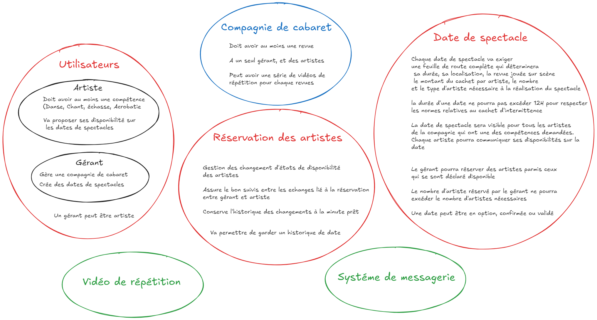
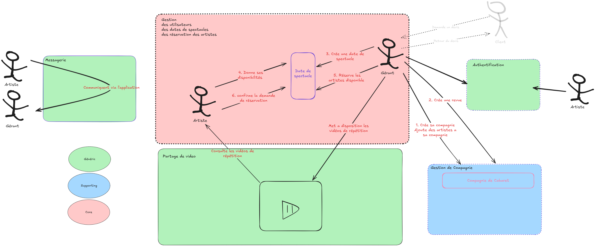

# Documentation des diagrammes C4 — Violette

## 1. Introduction

La **modélisation C4** (Context, Containers, Components, Code) permet de décrire une architecture logicielle à plusieurs niveaux d’abstraction, du système dans son environnement jusqu’aux composants internes. Violette utilise cette approche pour que les parties prenantes (équipe projet, examinateurs) comprennent rapidement le périmètre du système, son découpage technique et la structure du backend.

Les niveaux documentés dans ce projet sont :

- **System Context (Contexte système)** — Qui utilise Violette et avec quels systèmes externes elle interagit.
- **Container** — Comment la solution est découpée en applications et services (frontend, backend, bases de données).
- **Component** — Comment le backend est structuré en couches et en domaines métier.
- **Zoom composant (niveau 4)** — Détail des composants et flux à l'intérieur d'un domaine (ex. artistbooking).

Les quatre diagrammes sont versionnés dans le dépôt en PNG avec leur source PlantUML (procédure de régénération : [diagrams/README.md](diagrams/README.md)) ; ce document les explique et les relie à l'architecture réelle du projet, à jour de la version `v0.5.0`.

---

## 2. Diagramme C4 — System Context

### Ce que montre le diagramme

Le diagramme de **contexte système** place **Violette** au centre : c’est l’application dans son ensemble, sans détailler encore sa composition technique. Il répond à la question : *« Qui utilise le système et quels acteurs ou systèmes externes interagissent avec lui ? »*

### Acteurs principaux

Les acteurs directs du diagramme sont les utilisateurs qui ont un compte et utilisent Violette :

- **Gérant (Manager)** — Responsable de la compagnie. Il crée les dates de spectacle et compose les équipes d'artistes (présélection, demandes de réservation, suivi des réponses). C'est un utilisateur direct de Violette.
- **Artiste** — Membre ou collaborateur. Il déclare ses disponibilités sur les dates de spectacle et répond aux demandes de réservation. Lui aussi utilise Violette directement.

Le diagramme représente également le **client** en acteur externe : il commande un spectacle auprès de la compagnie **hors application** — c'est le gérant qui saisit la demande dans Violette.

### Système externe

- **Firebase Authentication** — Service externe utilisé par Violette pour l'authentification. Il délivre à l'application les jetons (JWT) qui identifient l'utilisateur, et expose les clés publiques qui permettent au backend d'en valider la signature. Violette ne gère elle-même ni les mots de passe ni la création des comptes d'authentification.

### Place de Violette

Violette est décrite comme l’**application centralisant la planification des spectacles et la coordination entre gérants et artistes**. À ce niveau, on ne distingue pas encore le frontend (Flutter) du backend (Quarkus) : ils forment un seul système du point de vue des utilisateurs et de Firebase.

---

## 3. Diagramme C4 — Container

### Ce que montre le diagramme

Le diagramme **Container** décompose Violette en **conteneurs** : les principales applications et bases de données qui composent la solution. Chaque conteneur a une responsabilité claire et des échanges explicites avec les autres.

### Découpage principal

| Conteneur | Rôle |
|-----------|------|
| **Application mobile Flutter (Android)** | Seule interface utilisateur de la `v0.5.0`, pour les **gérants** comme pour les **artistes** : création et planification des dates, déclaration des disponibilités, réservations. Architecture Stacked/MVVM. |
| **Backend Java / Quarkus** | Cœur métier : API REST consommée par l'application mobile. Porte les règles métier et les gardes de sécurité (validation du JWT, ownership compagnie). |
| **Base de données relationnelle (MySQL en production / H2 en local et test)** | **Unique conteneur de persistance** : utilisateurs, rôles, compagnies, revues, dates de spectacle, disponibilités, réservations. Migrations Flyway. |

### Échanges

- Les **gérants** et les **artistes** utilisent la même application **mobile**, qui envoie les requêtes au **backend** (HTTPS, API REST, JWT joint à chaque appel).
- L'application **s'authentifie auprès de Firebase Authentication** et reçoit un jeton JWT ; le **backend** récupère les clés publiques de Firebase (OIDC) pour **valider la signature** du jeton, puis charge les rôles métier (`ARTIST`, `MANAGER`) depuis sa propre base. Il lit et écrit les données métier dans la **base relationnelle**.

### Cohérence avec le projet

Ce découpage reflète l'architecture réelle de la `v0.5.0` : une application mobile Flutter unique (Android), un backend Quarkus exposant une API REST, une seule base relationnelle pour la donnée métier, Firebase pour l'identité. Aucun autre client ni conteneur de persistance n'existe dans la version livrée.

---

## 4. Diagramme C4 — Component

### Ce que montre le diagramme

Le diagramme **Component** se concentre sur l’**intérieur du backend** Quarkus. Il met en évidence l’**architecture en couches** (Controller → Service → Repository) et les **modules métier** (domaines) qui structurent le code.

### Composant de sécurité

Un **composant Security** (ou équivalent) figure en entrée du backend : il est paramétré pour utiliser Firebase et sécurise l’accès aux endpoints. Concrètement, dans le projet, cela correspond au package `security/` : validation du JWT Firebase, enrichissement de l’identité avec les rôles chargés depuis la base, et fourniture du principal courant aux controllers.

### Domaines métier (couches Controller, Service, Repository)

Chaque domaine métier est représenté par un ensemble de composants typiques :

- **violetteuser** — Gestion des utilisateurs et des rôles (création de compte backend, chargement des rôles pour la sécurité). Données : utilisateurs, rôles.
- **showdate** — Gestion des dates de spectacle et du planning : création de dates, besoins par compétence, disponibilités des artistes. Données : dates de spectacle, besoins artistiques, disponibilités.
- **artistbooking** — Gestion des réservations des artistes : sélection, envoi des demandes de confirmation, réponses (acceptation / refus). Données : réservations et leur cycle de vie.
- **cabaretcompany** — Gestion des compagnies de cabaret et des revues associées. Données : compagnies, revues, membres.

Les modules **communication** et **video** (messagerie, vidéos de répétition), envisagés en avant-projet, **ne figurent plus sur le diagramme** : ils n'ont pas été implémentés et relèvent des versions ultérieures. Les domaines représentés sont les quatre effectivement livrés : **violetteuser**, **cabaretcompany**, **showdate** et **artistbooking**.

### Composants transverses

Le diagramme montre également les composants transverses de la `v0.5.0` :

- **`ManagerCompanyResolver`** — garde d'ownership compagnie (OWASP A01) : résout la compagnie du gérant authentifié et refuse tout accès hors périmètre (403). Les quatre domaines s'y adossent pour leurs opérations manager.
- **`GlobalExceptionMapper`** — neutralise les erreurs non mappées : réponse générique avec identifiant de corrélation, sans fuite de détail technique.
- **Événements CDI** (Event / Observer) — découplage inter-domaines : annulation en cascade des réservations à l'annulation d'une date, re-staffing automatique d'une date à l'annulation d'un booking.
- **Mappers MapStruct** — conversion Entity ↔ DTO à la frontière de l'API.

### Lien avec le code

Cette vue est alignée avec l’organisation réelle des packages sous `io.violette` :

- Chaque domaine possède son `controller`, `service`, `repository`, ainsi que `model`, `dto`, `mapper` et `exception`.
- Le flux des requêtes respecte bien : **Controller** (HTTP, délégation) → **Service** (logique métier) → **Repository** (accès base). Les controllers ne contiennent pas de logique métier ; les repositories ne font que de la persistance.
- Les endpoints de santé (ping, liveness) sont regroupés dans un module technique type **health**, à part des domaines métier.

---

## 5. Cohérence avec le projet réel

Les diagrammes C4 sont cohérents avec l’architecture effectivement développée pour les raisons suivantes.

- **Architecture en couches** — Le backend suit strictement Controller → Service → Repository ; aucune logique métier dans le controller, aucun accès base en dehors du repository. Le diagramme Component reflète cette séparation.
- **Bounded contexts / domaines** — Les packages `violetteuser`, `cabaretcompany`, `showdate` et `artistbooking` correspondent aux contextes métier décrits dans les diagrammes. Chaque domaine est un module clairement identifié avec ses couches.
- **Séparation frontend / backend** — Le frontend Flutter (application mobile Android) consomme une API REST exposée par le backend Quarkus ; le diagramme Container montre bien cette frontière et les échanges HTTPS.
- **Sécurité et découplage** — La garde d'ownership (`ManagerCompanyResolver`), le `GlobalExceptionMapper` et les observers CDI figurant sur la vue Component correspondent aux packages `security/` et `event/` du code (preuves détaillées dans `docs/securite-owasp.md`).
- **Firebase pour l’identité** — L’authentification repose sur Firebase (JWT) ; le backend valide le token et enrichit l’identité avec les rôles stockés en base. Le contexte et le container montrent Firebase comme système externe utilisé par Violette.
- **Base relationnelle pour la donnée métier** — En V1, une seule base relationnelle (MySQL en production, H2 en test) stocke utilisateurs, compagnies, dates de spectacle, disponibilités et réservations. La vue Container reflète cet état : aucun autre conteneur de persistance n’est présent.

Un examinateur peut donc s'appuyer sur les quatre diagrammes pour comprendre le positionnement de Violette, son découpage en conteneurs et la structure modulaire du backend, tout en vérifiant la correspondance avec le code sous `violette-back` et la documentation dans `violette-back/ARCHITECTURE.md`.

---

## 6. Diagramme C4 — Zoom composant (niveau 4)

Une quatrième vue propose un **zoom** sur un domaine métier du backend : le domaine **artistbooking**. Elle répond à la question : *« À l’intérieur de ce domaine, quels composants (classes ou modules) existent et comment interagissent-ils ? »*

### Ce que montre le diagramme

- **ArtistBookingController** — couche REST (JAX-RS) : sélection, désélection, envoi des demandes de confirmation, réponse artiste, **annulation par le gérant**.
- **ArtistBookingService** — logique métier : capacité, disponibilité, transitions de statut, **recyclage d'un booking terminal** lors d'une re-sélection, gardes `assert*`.
- **ArtistBookingRepository** — accès BDD (Panache), unicité de la paire (show_date, artist).
- **ArtistBookingEntity** — aggregate root (réservation, BookingStatus, BookingTimeline).
- **BookingStatusChangedEvent** — événement CDI émis à chaque transition de statut.
- **ArtistBookingMapper** — mapping Entity vers DTO (MapStruct).

Le zoom montre aussi deux composants **externes au domaine** avec lesquels il interagit :

- **`ManagerCompanyResolver`** (package `security`) — chaque opération manager passe par la garde d'ownership compagnie ;
- **`ShowDateRestaffingObserver`** (domaine `showdate`) — abonné à `BookingStatusChangedEvent`, il repasse une date `STAFFED` en `CONFIRMED` lorsqu'un booking est annulé : l'équipe n'est plus complète. Le même mécanisme événementiel porte l'annulation en cascade (`ShowDateCancellationObserver`), sans aucune dépendance directe entre les domaines `artistbooking` et `showdate`.

Les relations (délégation, persist, fire, notifie) reflètent le flux réel du code et illustrent la séparation des couches ainsi que le découplage via l'événement CDI.

### Source et génération du PNG

Comme les trois autres niveaux, ce diagramme est défini en **PlantUML** (C4-PlantUML) : source `docs/diagrams/c4-component-artistbooking.puml`, PNG `docs/diagrams/c4-component-artistbooking.png`. Procédure de régénération : [docs/diagrams/README.md](diagrams/README.md).

---

## 7. Emplacement des diagrammes

Les fichiers des diagrammes C4 se trouvent dans le dépôt aux emplacements suivants :

| Niveau | Source PlantUML | PNG |
|--------|-----------------|-----|
| System Context | `docs/diagrams/c4-context.puml` | `docs/diagrams/c4-context.png` |
| Container | `docs/diagrams/c4-container.puml` | `docs/diagrams/c4-container.png` |
| Component (backend) | `docs/diagrams/c4-component-backend.puml` | `docs/diagrams/c4-component-backend.png` |
| Zoom composant (niveau 4) | `docs/diagrams/c4-component-artistbooking.puml` | `docs/diagrams/c4-component-artistbooking.png` |

La procédure de régénération (Docker, CLI, en ligne, extension VS Code) est décrite dans [docs/diagrams/README.md](diagrams/README.md).

Le diagramme Container est affiché dans le **README** racine (section « Architecture en bref ») ; les autres se consultent depuis ce document et le dossier `docs/diagrams/`. La documentation détaillée du backend (couches, packages, sécurité, patterns) est dans **`violette-back/ARCHITECTURE.md`**.

---

## 8. Diagrammes de vision produit (avant-projet)

Deux diagrammes complémentaires, issus de la phase d'avant-projet, sont conservés dans `docs/diagrams/` : la cartographie des **bounded contexts DDD** et le **domain storytelling** des flux fonctionnels.

> **Statut de ces diagrammes.** Ils décrivent la **vision produit cible**, définie lors de la phase d'avant-projet, et ne représentent pas le périmètre livré. Les contextes *Vidéo de répétition* et *Messagerie* qui y figurent n'ont pas été implémentés : ils relèvent des versions ultérieures (voir [technical-debt.md](technical-debt.md), « Évolutions futures »). Les contextes effectivement livrés en `v0.5.0` sont **Utilisateurs**, **Compagnie de cabaret**, **Date de spectacle** et **Réservation des artistes** — ceux-là mêmes que détaillent les diagrammes C4 ci-dessus.

