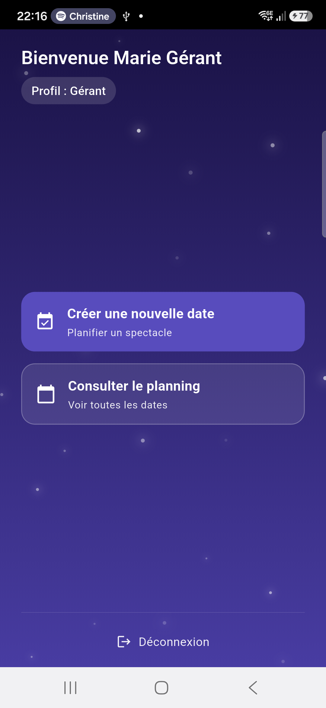
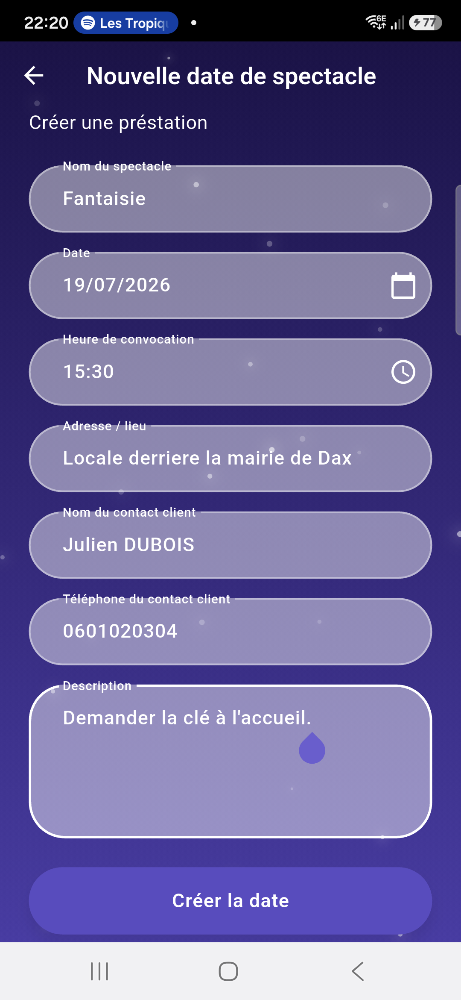
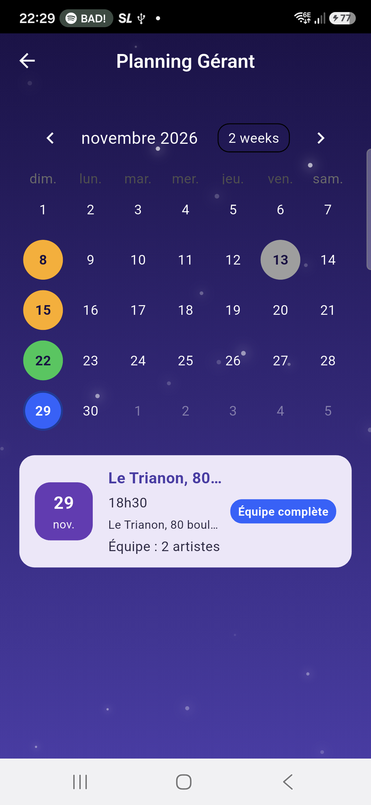
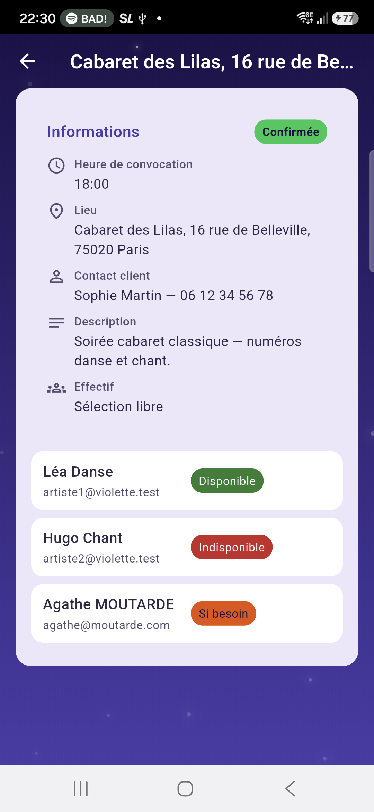
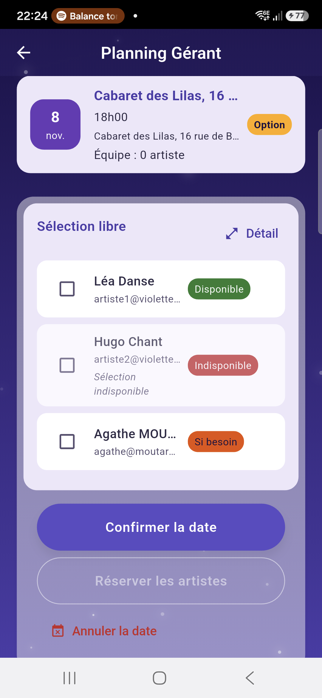
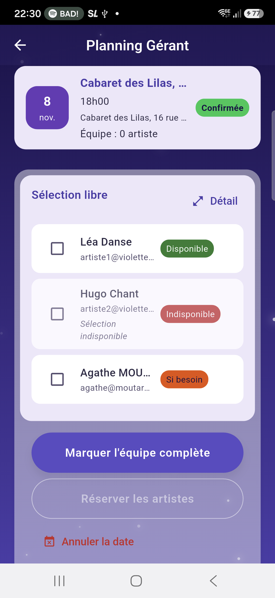
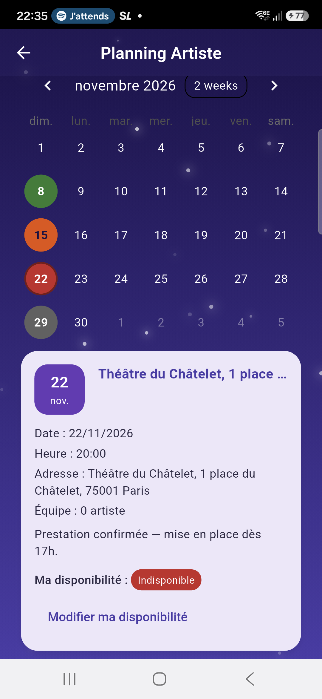
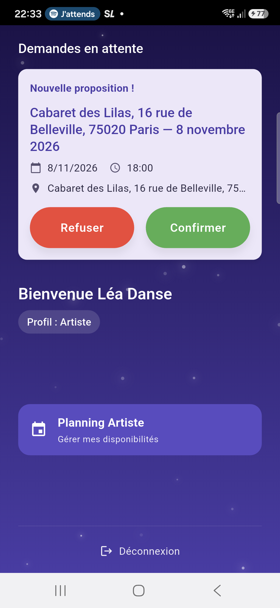

# Manuel utilisateur — Violette

## 1. Présentation de l'application

Violette est une application qui aide les compagnies de cabaret à **planifier leurs spectacles** et à **réserver leurs artistes** de façon simple et centralisée.

Elle permet de :
- faciliter la planification des dates de spectacle ;
- centraliser les disponibilités des artistes ;
- simplifier la réservation des artistes et le suivi des confirmations.

Deux types d'utilisateurs utilisent Violette : le **gérant** (responsable de la compagnie) et l'**artiste** (membre ou collaborateur). Les écrans et les actions disponibles dépendent de votre rôle.

---

## 2. Création d'un compte

> **Important — une seule compagnie pour l'instant.** Dans cette version, la création et la gestion
> de compagnies ne sont pas encore disponibles. **Tous les comptes créés — gérants comme artistes —
> sont automatiquement rattachés à la même compagnie**, « Dream's Production ». Concrètement, si deux
> personnes créent un compte gérant, elles administreront la même compagnie et verront les mêmes
> dates. La gestion de plusieurs compagnies est prévue pour une version ultérieure.

Pour utiliser Violette, vous devez d'abord créer un compte.

1. Accédez à l'écran d'inscription.
2. Indiquez votre **prénom**, votre **nom** et votre **adresse e-mail**.
3. Choisissez votre **rôle** : gérant ou artiste (un même compte peut avoir les deux rôles si besoin).
4. Validez la création du compte.

Votre connexion est sécurisée : seul vous pouvez accéder à votre espace avec vos identifiants.

---

## 3. Connexion à l'application

1. Ouvrez l'application Violette.
2. Saisissez votre **adresse e-mail** et votre **mot de passe**.
3. Validez la connexion.

Vous accédez ensuite à votre tableau de bord. Les fonctionnalités affichées dépendent de votre rôle : le gérant voit la gestion des dates et des réservations ; l'artiste voit ses disponibilités et ses demandes en attente.

*L'écran d'accueil d'un gérant : le profil est affiché, avec les deux actions principales — créer une date ou consulter le planning.*

---

## 4. Utilisation pour un gérant

### Gérer les spectacles et les artistes

En tant que gérant, vous pilotez les dates de spectacle et la constitution des équipes artistiques.

#### Créer une date de spectacle

1. Depuis le planning ou le menu, choisissez **Créer une date de spectacle**.
2. Renseignez les informations principales :
   - la date du spectacle ;
   - le lieu et l'adresse ;
   - l'heure de rendez-vous ;
   - les coordonnées du contact client.

*Le formulaire de création rempli, prêt à valider. Relisez bien chaque champ avant d'appuyer sur « Créer la date » : l'édition n'est pas possible après création (voir plus bas).*

Une fois la date créée, elle apparaît dans votre planning.

*Le planning gérant : chaque jour porte la couleur du statut de sa date — gris « Demande client », orange « Option », vert « Confirmée », bleu « Équipe complète » (voir le détail des statuts en section 6). Sélectionnez un jour pour afficher la date correspondante.*

#### Annuler une date

Depuis le détail d'une date, le bouton **Annuler la date** la retire du planning.

> **Attention — les artistes engagés sont annulés aussi.** L'annulation d'une date annule
> automatiquement **toutes les réservations** en cours sur cette date : les artistes présélectionnés
> ou confirmés voient leur engagement annulé et la date disparaît de leur planning. Une confirmation
> vous est demandée avant l'annulation.

Si vous annulez la réservation d'un seul artiste sur une date dont l'équipe était complète, la date
repasse automatiquement au statut **Confirmée** : l'équipe n'est plus au complet.

#### Consulter le détail d'une date

Depuis le planning, sélectionnez une date pour déplier son détail, puis appuyez sur **Détail** pour ouvrir sa fiche complète. Vous y retrouvez l'ensemble de la feuille de route : heure de convocation, adresse complète, contact client, description et effectif, ainsi que le statut de la date et les artistes qui y sont engagés.

> **Vérifiez vos informations avant de valider la création.** Une date créée ne peut pas encore être modifiée depuis l'application : la fiche est consultable, mais l'édition n'est pas disponible dans cette version.

*La fiche de consultation d'une date : toute la feuille de route en lecture seule — heure de convocation, lieu complet, contact client, description, effectif, statut et disponibilités des artistes.*

#### Définir les besoins artistiques *(fonctionnalité à venir)*

La définition détaillée des besoins par compétence (danse, chant, acrobaties, etc.) et du nombre d'artistes requis par compétence est **prévue dans une version ultérieure**. Dans la version actuelle, le champ « Artistes nécessaires » du formulaire de création de date est **informatif** : il n'est pas encore pris en compte pour contraindre la constitution de l'équipe.

#### Consulter les disponibilités

Avant de sélectionner les artistes, consultez les **disponibilités** déclarées pour la date :

- **Disponible** : l'artiste peut être retenu.
- **Si besoin** : l'artiste peut venir, mais n'est pas prioritaire.
- **Indisponible** : l'artiste ne peut pas être sélectionné pour cette date.

#### Sélectionner les artistes

Parmi les artistes **disponibles**, choisissez ceux que vous souhaitez retenir pour la date. Vous ne pouvez sélectionner que des artistes ayant déclaré être disponibles.

*Une date en « Option » : chaque artiste porte sa pastille de disponibilité (vert « Disponible », orange « Si besoin », rouge « Indisponible » — non sélectionnable), avec sa case de sélection. Le bouton « Réserver les artistes » est grisé : l'envoi des demandes n'est possible que sur une date « Confirmée » (voir l'encadré ci-dessous).*

#### Envoyer les demandes de confirmation

> **À savoir — la date doit être confirmée.** Le bouton **Réserver les artistes** n'est actif que
> lorsque la date est au statut **Confirmée**. Tant qu'elle est en **Option**, vous pouvez
> présélectionner des artistes (cocher leur nom), mais pas encore leur envoyer de demande ferme :
> il faut d'abord que le client valide la prestation. Cette contrainte est amenée à évoluer, pour
> permettre d'envoyer les demandes dès la pose de l'option.

Une fois vos choix effectués, **envoyez les demandes de confirmation** aux artistes sélectionnés. Chaque artiste recevra une demande et pourra accepter ou refuser. Vous pourrez suivre l'état des réponses dans l'application.

*La même date passée en « Confirmée » : la réservation devient possible — le bouton « Réserver les artistes » s'active dès qu'au moins un artiste est coché.*

---

## 5. Utilisation pour un artiste

### Gérer ses disponibilités et ses engagements

En tant qu'artiste, vous gérez vos disponibilités et répondez aux demandes du gérant.

#### Déclarer ses disponibilités

Pour chaque date de spectacle à venir, indiquez votre statut :

- **Disponible** : vous pouvez être retenu pour cette date.
- **Si besoin** : vous êtes disponible si l'équipe a besoin de vous, mais vous n'êtes pas prioritaire.
- **Indisponible** : vous ne pouvez pas participer à cette date.

Il est conseillé de mettre à jour vos disponibilités régulièrement pour que le gérant dispose d'informations à jour.

*Le Planning Artiste : chaque jour porte la couleur de votre disponibilité déclarée, et la carte sous le calendrier permet de la consulter et de la modifier pour la date sélectionnée.*

> **Disponibilité verrouillée après confirmation.** Une fois que vous êtes **confirmé** sur une date (vous avez accepté une demande de réservation), vous ne pouvez plus modifier votre disponibilité sur cette date. Pour tout désistement, contactez directement le gérant.

#### Répondre aux demandes de réservation

Lorsque le gérant vous envoie une **demande de réservation** pour une date :

1. Consultez la demande (date, lieu, informations éventuelles).
2. Vous pouvez **accepter** ou **refuser** la demande.
3. Votre réponse est enregistrée immédiatement.

Une réponse rapide facilite l'organisation du gérant.

*Une demande de réservation en attente, affichée dès l'écran d'accueil de l'artiste : « Confirmer » ou « Refuser » en un geste.*

#### Consulter ses engagements

Lorsque vous **acceptez** une demande, la réservation est **confirmée**. Depuis le **Planning Artiste**, vous suivez l'état de chaque date où vous êtes impliqué : présélectionné par le gérant, confirmé, ou annulé. Vous pouvez à tout moment consulter la liste de vos engagements à venir pour suivre les dates sur lesquelles vous êtes retenu.

---

## 6. Comprendre les statuts de réservation

### Statut d'une date de spectacle

Chaque date affiche un statut, visible dans le planning et sur sa fiche :

| Statut | Ce qu'il signifie | Ce que le gérant peut faire |
|---|---|---|
| **Demande client** | Un client a pris contact, le besoin est en cours de qualification. Les informations peuvent être incomplètes. | Aucune sollicitation d'artiste à ce stade. |
| **Option** | Le devis est envoyé, l'option est posée. La date est ouverte à la préparation. | Consulter les disponibilités et présélectionner des artistes (sans engagement ferme). |
| **Confirmée** | Le client a validé la prestation. | Envoyer les demandes de réservation fermes aux artistes présélectionnés. |
| **Équipe complète** | L'effectif est réuni et sécurisé. | La composition de l'équipe est verrouillée. |
| **Annulée** | La date est abandonnée ou annulée. | Aucune action. Les artistes engagés sont annulés automatiquement. |

Le gérant fait évoluer ce statut avec les boutons **Passer en option**, **Confirmer la date** et
**Marquer l'équipe complète**.

Une réservation peut passer par plusieurs états :

| Statut | Signification |
|--------|----------------|
| **Sélectionné** | Le gérant vous a retenu pour la date ; la demande de confirmation n'a pas encore été envoyée (ou vous ne l'avez pas encore reçue). |
| **En attente de confirmation** | Une demande vous a été envoyée ; vous devez accepter ou refuser. |
| **Confirmé** | Vous avez accepté ; votre participation à la date est enregistrée. |
| **Refusé** | Vous avez refusé la demande ; vous ne participez pas à cette date. |

Ces statuts permettent au gérant et à l'artiste de savoir où en est chaque réservation.

---

## 7. Bonnes pratiques

- **Déclarez vos disponibilités régulièrement** pour que le gérant ait une vision à jour.
- **Répondez rapidement aux demandes** de réservation pour faciliter la planification.
- **Vérifiez les informations de la date** (lieu, heure, détails) avant d'accepter une demande.
- En tant que gérant, **vérifiez les disponibilités** avant d'envoyer les demandes pour limiter les refus.
